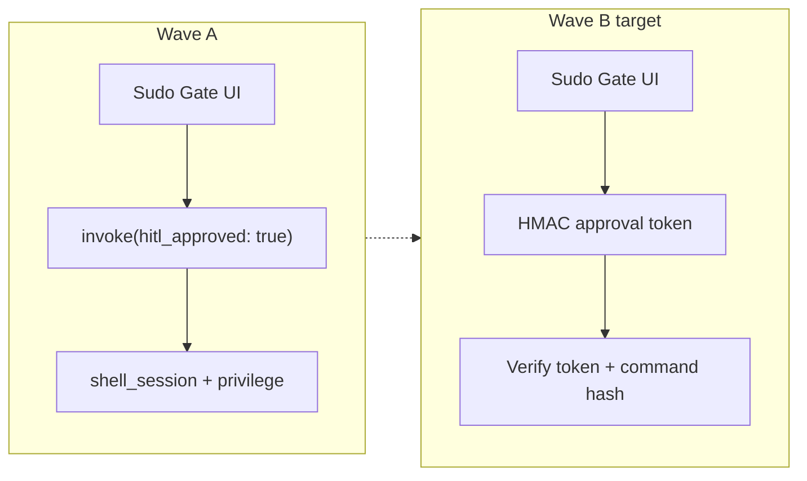
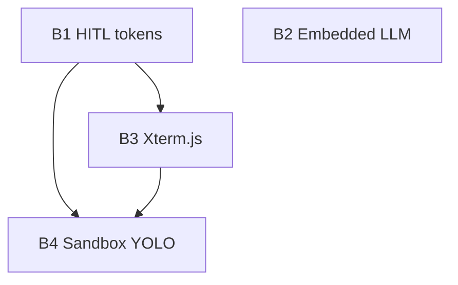

# Wave B Roadmap — State-of-the-Art Systems

**Status:** Shipped on `main` (June 2026)  
**Audience:** Engineering, security review, portfolio narrative  
**Last updated:** June 2026

This document captures four **systems-level** upgrades from the follow-up evaluation. They build on what shipped in Wave A (structured `GnomadError` payloads, elevation hardening, `App.tsx` decomposition) and address residual alpha gaps called out in [`CODE_REVIEW.md`](CODE_REVIEW.md) and [`SECURITY_MODEL.md`](SECURITY_MODEL.md).

---

## Current baseline

| Area | Today |
|------|--------|
| HITL | **B1 shipped:** HMAC tokens via [`hitl_token.rs`](../src-tauri/src/hitl_token.rs); boolean bypass rejected |
| Local LLM | External **Ollama** HTTP; in-process **GGUF** for planner + optional local chat (`embedded-llm` build) |
| YOLO! | Broader FS via [`agent_settings`](../src-tauri/src/agent_settings.rs); optional **sandboxed shell** (B4) in YOLO + experimental flag |
| Terminal UX | **xterm.js** live stream + replay on command cards; summary cards for simple runs |



---

## Recommended delivery order

| Order | Initiative | Why first |
|-------|------------|-----------|
| **B1** | Cryptographic HITL tokens | Closes real IPC bypass class; small Rust surface; unblocks enterprise narrative |
| **B2** | In-process local LLM | ✓ B2a planner + B2b local chat shipped |
| **B3** | True terminal (Xterm.js) | ✓ Live stream + replay in chat |
| **B4** | Micro-sandboxing for YOLO | ✓ Experimental sandbox-exec / bwrap |

---

## B1 — Cryptographic HITL approval tokens

### Problem

Any client that can call `shell_session_run` or `agent_execute_tool` with `hitl_approved: true` may bypass the UI gate. Safety heuristics still run, but **approval is not cryptographically bound** to a specific command, time window, or session.

### Design

1. **`check_command_safety`** (or a dedicated `request_hitl_token` command) returns:
   - `requires_hitl_approval`, `danger_reason` (unchanged)
   - **`approval_nonce`** + **`approval_token`** when HITL is required

2. **Token payload** (signed, not encrypted — local app only):

   ```text
   v1 | command_sha256 | nonce | issued_at_unix | expires_at_unix | scope
   ```

   - `command_sha256`: SHA-256 of normalized command string (trim, NFC)
   - `scope`: `shell_run` | `elevated` | `path_once` (future)
   - TTL: e.g. **60–120 seconds**, single-use (nonce stored in memory until consumed or expired)

3. **Signing:** HMAC-SHA256 with a **per-install secret** generated on first launch and stored in OS keychain (`gnomad-hitl-secret`), not in frontend.

4. **Execution:** `shell_session_run` / elevated path accepts optional `approval_token` instead of bare `hitl_approved`. Rust:
   - Verifies HMAC + expiry + command hash match + nonce not reused
   - Re-runs `check_command_safety` (defense in depth)
   - On success, burns nonce

5. **Frontend:** After Sudo Gate approve, pass `approval_token` from the pending safety response — never a raw boolean.

6. **Elevation:** `execute_elevated_command` requires token with `scope=elevated` and matching command hash.

### Files (indicative)

| Layer | Files |
|-------|--------|
| Rust | New `hitl_token.rs`; `privilege.rs`, `shell_session.rs`, `agent_runtime.rs`, `lib.rs` |
| TS | `shellSession.ts`, `agentRuntime.ts`, `useAgentExecution.ts`, `agentLoop.ts` |
| Docs | `SECURITY_MODEL.md`, `QA_CHECKLIST.md` (IPC bypass test case) |

### Acceptance criteria

- [x] `hitl_approved: true` without valid token → `safety_blocked` JSON payload
- [x] Token for command A rejected when executing command B
- [x] Reused token rejected (expiry test: manual)
- [x] Unit tests: sign/verify, wrong hash, replay, boolean bypass
- [x] Manual: approve in UI → success; devtools invoke with boolean only → fail

### Effort & risk

| | |
|--|--|
| **Effort** | ~3–5 days |
| **Risk** | Low–medium (API migration; keep deprecated bool one release behind feature flag) |

---

## B2 — In-process native local LLM (Candle or llama.cpp)

### Problem

Ollama is an extra daemon, version skew, and install step. Portfolio story: “local works out of the box” requires an **embedded** inference path for small models (e.g. 1B Qwen-Coder for planner / tag extraction).

### Options

| Backend | Pros | Cons |
|---------|------|------|
| **llama-cpp-2** (Rust bindings) | Mature GGUF ecosystem; matches existing GGUF settings field | Binary size, CPU/GPU feature matrix per platform |
| **Candle** (Hugging Face) | Pure Rust, good for custom models | Heavier integration for chat templates; GPU paths vary |

**Recommendation:** **llama-cpp-2** for v1 in-process path (aligns with stored GGUF path + planner use case); keep Ollama as optional “bring your own models.”

### Design

1. **`local_inference` module** in `src-tauri`:
   - `load_model(path: PathBuf, n_ctx, n_threads)` — lazy singleton
   - `complete(prompt, max_tokens, stop)` → string
   - `plan_command(prose) -> Result<String, GnomadError>` — used by command planner

2. **Model delivery:**
   - **Phase B2a:** User-selected GGUF on disk (Settings)
   - **Phase B2b (optional):** Bundled tiny model in app resources (size cap ~500MB–1GB for alpha)

3. **Frontend:** Provider mode `local-embedded` vs `local-ollama`; same chat UI, different backend invoke.

4. **Build:** Feature flag `embedded-llm`; CI builds without it on constrained runners; macOS/Windows/Linux matrix docs in [`BUILD_PLATFORMS.md`](BUILD_PLATFORMS.md).

### Acceptance criteria

- [x] Planner works with no Ollama process when GGUF configured
- [x] Graceful `llm` error payload if model missing or load fails
- [x] Document RAM/CPU expectations (e.g. 1B Q4 ≈ 1GB RAM) — see BUILD.md
- [x] Ollama path unchanged (regression)

### Effort & risk

| | |
|--|--|
| **Effort** | ~2–4 weeks (bindings, threading, packaging) |
| **Risk** | Medium–high (artifact size, Metal/CUDA/CPU fallbacks, licensing of bundled weights) |

---

## B3 — True terminal emulation (Xterm.js)

### Problem

PTY output is reduced to stdout/stderr strings for cards. **ANSI colors, progress bars, TUI apps, and interactive prompts** are lossy or confusing (stall/timeout heuristics fight full-screen TUIs).

### Design

1. **Rust (minimal change):** Already emits PTY chunks via events — add optional **base64 or raw UTF-8 frame** event `shell-pty-output` with session id (if not already sufficient).

2. **Frontend:**
   - Add `@xterm/xterm` + fit addon
   - **`TerminalPanel`** component: embedded in chat when user expands a run, or docked below composer
   - Wire `subscribeShellOutput` → `term.write(data)`
   - **Input:** optional `term.onData` → new `shell_session_write` command for interactive sessions (separate from one-shot `shell_run`)

3. **Modes:**
   - **Compact (default):** Keep `ShellCommandBlock` summary for simple commands
   - **Live:** Open xterm when command tagged interactive or user clicks “Show terminal”

4. **Security:** xterm does not bypass gates; interactive mode still requires HITL token for flagged commands.

### Acceptance criteria

- [x] `ls --color=auto`, `npm install` progress render in live mode / replay
- [x] Stop button sends interrupt
- [x] No regression for cloud agent tool loop (summary cards still work)
- [x] Cross-platform: macOS, Windows, Linux windowed + panel

### Effort & risk

| | |
|--|--|
| **Effort** | ~1–2 weeks |
| **Risk** | Medium (bundle size, focus/keyboard in Tauri webview, accessibility) |

---

## B4 — Micro-sandboxing for YOLO! mode

### Problem

YOLO expands filesystem reach; shell on host PTY can still **exfiltrate, pivot, or damage** outside workspace if the model is tricked. Goal: when YOLO is on, **contain shell side effects** without breaking normal Standard mode.

### Design (platform-specific)

| OS | Mechanism | Notes |
|----|-----------|--------|
| **macOS** | `sandbox-exec` with **dynamic profile** per session | Profile allows: workspace R/W, temp dir, deny network optional, deny `~/.ssh` etc. Fragile across macOS versions — needs version matrix |
| **Linux** | **bubblewrap** / user namespaces | Mount minimal FS; require optional dep ([`LINUX_PACKAGES.md`](LINUX_PACKAGES.md)) |
| **Windows** | **Workspace-scoped init** (`yolo-shell-init.cmd`) | TEMP + cwd scoped to workspace; **network not blocked** — full AppContainer deferred |

**Principle:** Sandbox wraps **shell execution path only**; `agent_fs` already path-gated — optionally route YOLO shell through `bwrap` helper binary shipped with app.

### UX

- Settings → YOLO: sub-option **“Sandbox shell (experimental)”** with platform badge
- Audit log records `sandboxed: true` and profile hash

### Acceptance criteria

- [x] In sandboxed YOLO: reads outside workspace blocked; workspace writes allowed (profile-dependent)
- [x] Escape attempts documented in test notes (not pen-test complete)
- [x] Clear fallback when sandbox helper missing (disable feature, error not silent host run)

### Effort & risk

| | |
|--|--|
| **Effort** | ~4–8 weeks across OSes |
| **Risk** | **High** — support burden, false sense of security if profiles wrong; enterprise may demand third-party audit |

---

## Cross-cutting dependencies



- **B4** should assume **B1** so sandboxed runs cannot skip gates via IPC.
- **B3** interactive PTY should require tokens for elevated/interactive flows.
- **B2** is largely orthogonal; improves planner without widening shell attack surface.

---

## Mapping to product versions

| Version | Wave B items |
|---------|----------------|
| **v0.2 beta** | B1 (HITL tokens) + Wave B error migration (`llm`, `command_planner`, `chat_history`) |
| **v0.3** | B3 (xterm) + B2a (GGUF in-process planner) |
| **v0.4+** | B2b (optional bundled model), B4 (sandbox experimental per OS) |

See also [`ROADMAP.md`](ROADMAP.md).

---

## Explicit non-goals (Wave B)

- Full VM per command (Docker/Podman required) — too heavy for default install
- Remote attestation / hardware security modules
- Replacing cloud providers with on-device 70B models
- Autonomous background agents without user message

---

## Related docs

- [`SECURITY_MODEL.md`](SECURITY_MODEL.md) — threat model + future HITL token section  
- [`AGENT_CAPABILITIES_PROPOSAL.md`](AGENT_CAPABILITIES_PROPOSAL.md) — agent architecture  
- [`CODE_REVIEW.md`](CODE_REVIEW.md) — Wave A completion status  
- [`CROSS_PLATFORM_CHECKLIST.md`](CROSS_PLATFORM_CHECKLIST.md) — smoke tests when each B item lands  
